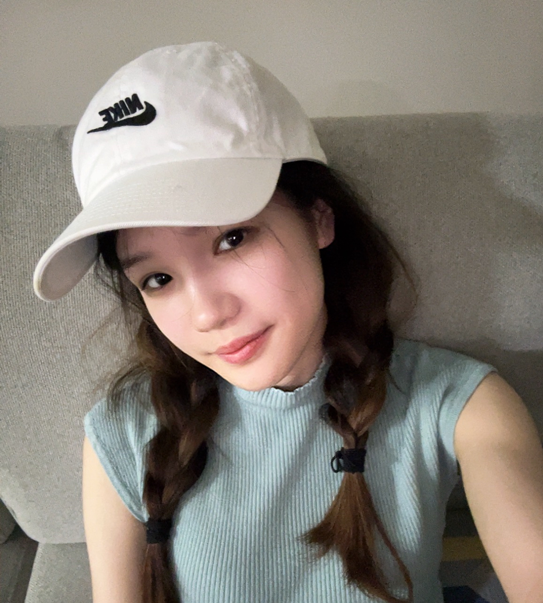
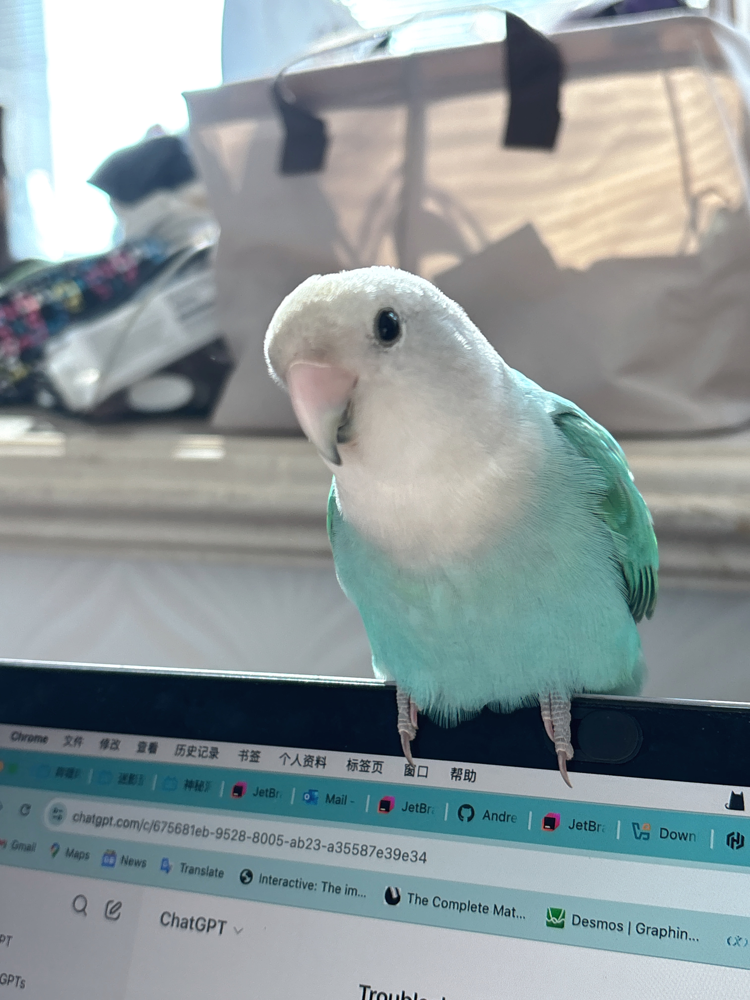

# About Us

We are a team based in the [School of Computing, National University of Singapore](http://www.comp.nus.edu.sg).

You can reach us at the email `seer[at]comp.nus.edu.sg`

## Project team

### Jane Doe

[[homepage](http://www.comp.nus.edu.sg/~damithch)]
[[github](https://github.com/johndoe)]
[[portfolio](team/johndoe.md)]

* Role: Project Advisor

### Zhu Rong

[[github](http://github.com/ZhuRong818)]
[[portfolio](team/johndoe.md)]

* Role: Team Lead
* Responsibilities: UI

### Chen Guo

[[github](http://github.com/chenguo3125)] 
[[portfolio](team/johndoe.md)]

* Role: Developer
* Responsibilities: Data

### Huang Xiaotong

[[github](http://github.com/xiaotong0329)]
[[portfolio](team/johndoe.md)]

* Role: Developer
* Responsibilities: Dev Ops + Threading

### Cao Yuewei

[[github](http://github.com/CYW0416)]
[[portfolio](team/johndoe.md)]

* Role: Developer
* Responsibilities: UI
