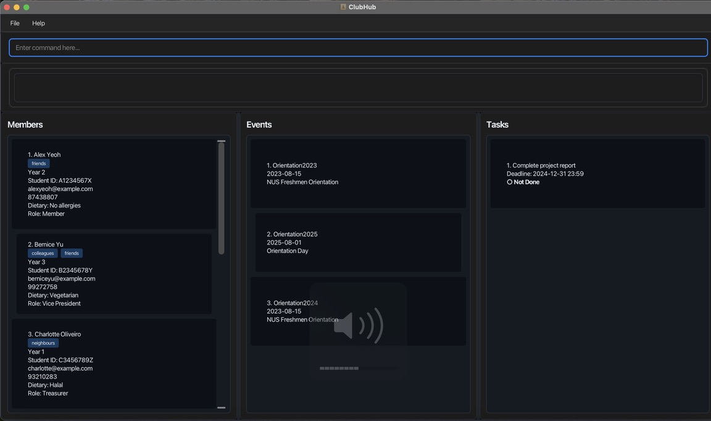
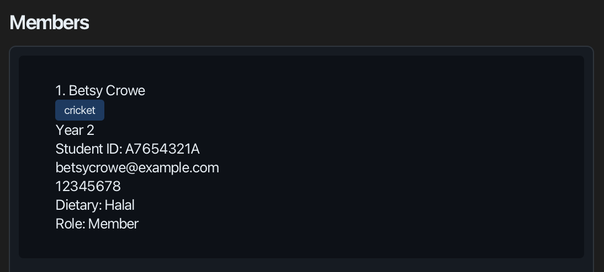
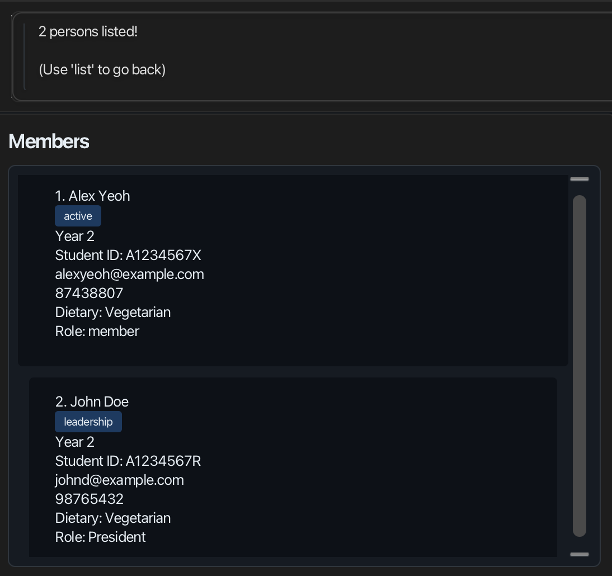
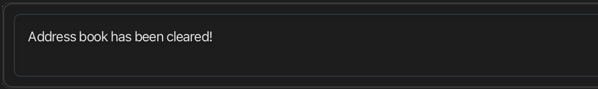
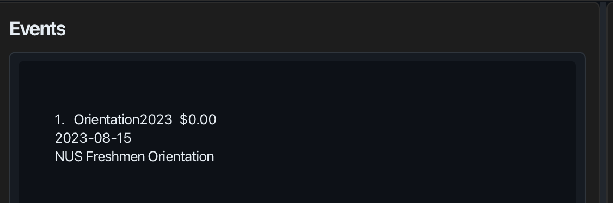

# ClubHub User Guide

ClubHub is a **desktop app for managing contacts, optimized for use via a  Line Interface** (CLI) while still having the benefits of a Graphical User Interface (GUI). If you can type fast, ClubHub can get your contact management tasks done faster than traditional GUI apps.

<!-- * Table of Contents -->
<page-nav-print />

--------------------------------------------------------------------------------------------------------------------

## Quick start

1. Ensure you have Java `17` or above installed in your Computer.<br>
   **Mac users:** Ensure you have the precise JDK version prescribed [here](https://se-education.org/guides/tutorials/javaInstallationMac.html).

1. Download the latest `.jar` file from [here](https://github.com/AY2526S1-CS2103T-T10-3/tp/releases).

1. Copy the file to the folder you want to use as the _home folder_ for your ClubHub.

1. Open a command terminal, `cd` into the folder you put the jar file in, and use the `java -jar clubhub.jar` command to run the application.<br>
   A GUI similar to the below should appear in a few seconds. Note how the app contains some sample data.<br>
   

1. Type the command in the command box and press Enter to execute it. e.g. typing **`help`** and pressing Enter will open the help window.<br>
   Some example commands you can try:

   * `list` : Lists all contacts.

   * `add n/John Doe y/3 s/A1234567X e/johnd@example.com p/98765432 d/Vegetarian r/President t/leadership` : Adds a club member.

   * `addevent ev/Orientation2025 dt/2025-08-15 desc/NUS Freshmen Orientation` : Adds an event.

   * `clear` : Deletes all contacts.

   * `exit` : Exits the app.

1. Refer to the [Features](#features) below for details of each command.

--------------------------------------------------------------------------------------------------------------------

## Features

<box type="info" seamless>

**Notes about the command format:**<br>

* Words in `UPPER_CASE` are the parameters to be supplied by the user.<br>
  e.g. in `add n/NAME`, `NAME` is a parameter which can be used as `add n/John Doe`.

* Items in square brackets are optional.<br>
  e.g `n/NAME [t/TAG]` can be used as `n/John Doe t/friend` or as `n/John Doe`.

* Items with `…`​ after them can be used multiple times including zero times.<br>
  e.g. `[t/TAG]…​` can be used as ` ` (i.e. 0 times), `t/friend`, `t/friend t/family` etc.

* Parameters can be in any order.<br>
  e.g. if the command specifies `n/NAME p/PHONE_NUMBER`, `p/PHONE_NUMBER n/NAME` is also acceptable.

* Extraneous parameters for commands that do not take in parameters (such as `help`, `list`, `exit` and `clear`) will be ignored.<br>
  e.g. if the command specifies `help 123`, it will be interpreted as `help`.

* If you are using a PDF version of this document, be careful when copying and pasting commands that span multiple lines as space characters surrounding line-breaks may be omitted when copied over to the application.
</box>


### Viewing help : `help`

Shows a message explaining how to access the help page.

  

Format: `help`


### Adding a person: `add`

Adds a person to the ClubHub.

Format: `add n/NAME y/YEAR s/STUDENT_NUMBER e/EMAIL p/PHONE d/DIETARY_REQUIREMENTS r/ROLE [t/TAG]…​`

<box type="tip" seamless>

**Tip:** A person can have any number of tags (including 0)
</box>

Examples:
* `add n/John Doe y/3 s/A1234567X e/johnd@example.com p/98765432 d/Vegetarian r/President`
* `add n/Betsy Crowe y/2 s/A7654321A e/betsycrowe@example.com p/12345678 d/Halal r/Member t/cricket`

  
display format of member's contact in ClubHub:
  


### Listing all persons : `list`

Shows a list of all persons in the ClubHub.

  

Format: `list`


### Editing a person : `edit`

Edits an existing person in the ClubHub.

Format: `edit INDEX [n/NAME] [p/PHONE] [e/EMAIL] [y/YEAR] [s/STUDENT_NUMBER] [d/DIETARY] [r/ROLE] [t/TAG]…​`

* Edits the person at the specified `INDEX`. The index refers to the index number shown in the displayed person list. The index **must be a positive integer** 1, 2, 3, …​
* At least one of the optional fields must be provided.
* Existing values will be updated to the input values.
* When editing tags, the existing tags of the person will be removed i.e adding of tags is not cumulative.
* You can remove all the person’s tags by typing `t/` without
    specifying any tags after it.

Examples:
*  `edit 1 p/91234567 e/johndoe@example.com` Edits the phone number and email address of the 1st person to be `91234567` and `johndoe@example.com` respectively.
*  `edit 2 n/Betsy Crower t/` Edits the name of the 2nd person to be `Betsy Crower` and clears all existing tags.
  

### Locating persons by name: `find`

Finds persons whose names contain any of the given keywords.

Format: `find KEYWORD [MORE_KEYWORDS]`

* The search is case-insensitive. e.g `hans` will match `Hans`
* The order of the keywords does not matter. e.g. `Hans Bo` will match `Bo Hans`
* Both the name and attributes can be searched.
* Only full words will be matched e.g. `Han` will not match `Hans`
* Persons matching ALL the attribute keywords will be returned (i.e. `AND` search).
  e.g. `year 2 vegetarian` will return all the students who are both `Year 2` and `Vegetarian`

Examples:
* `find alex` returns `Alex Yeoh`, `Alex Lee`<br>
* `find vegetarian year 2 ` returns students who are both `vegetarian` and `year 2`
  

### Deleting a person : `delete`

Deletes the specified person from the ClubHub.

Format: `delete INDEX`

* Deletes the person at the specified `INDEX`.
* The index refers to the index number shown in the displayed person list.
* The index **must be a positive integer** 1, 2, 3, …​

Examples:
* `list` followed by `delete 2` deletes the 2nd person in the ClubHub.
* `find Betsy` followed by `delete 1` deletes the 1st person in the results of the `find` command.

### Clearing all entries : `clear`

Clears all entries from the ClubHub.
  
Format: `clear`

### Exiting the program : `exit`

Exits the program.

Format: `exit`

### Importing members : `import`

Imports member details from a CSV file into the ClubHub.

Format: `import /from FILEPATH`

Examples:
* `import /from members.csv`

### Exporting members : `export`

Exports all members in the ClubHub to a CSV file.

Format: `export /to FILEPATH`

Examples:
* `export /to members.csv`

### Events : `addevent`, `deleteevent`

Manages events in the ClubHub.

Formats:
* `addevent e/EVENTID dt/DATE desc/DESCRIPTION`
* `deleteevent e/EVENTID`

Examples:
* `deleteevent e/Orientation2025`
* `addevent e/Orientation2023 dt/2023-08-15 desc/NUS Freshmen Orientation`
  
display format of the event in ClubHub:
  


### Adding attendance : `addattendance`

Adds the member to the attendance list.

Format: `addattendance e/EVENTID m/MEMBER[/MEMBER]...`

* Adds the member who is supposed to attend the event to the attendance list.
* If the member has already been added the attendance list, the command will ignore the duplicate and continue.
* Both the member and event must exist in the system.

Examples:
* `addattendance e/Orientation2023 m/John Doe` - Adds John Doe to the attending list of Orientation2023
* `addattendance e/Meeting2023 m/Jane Smith` - Adds Jane Smith to the attending list of Meeting2023


### Marking attendance : `markattendance`

Marks members as attended for an event.

Format: `markattendance e/EVENTID m/MEMBER[/MEMBER]...`

* Marks the listed members as present for the specified event.
* Each member must already exist in the attendance list for the event.
* Members who are already marked present remain present and are listed in the feedback message.

Examples:
* `markattendance e/Orientation2023 m/John Doe` - Marks John Doe as attended for Orientation2023
* `markattendance e/Meeting2023 m/Jane Smith` - Marks Jane Smith as attended for Meeting2023


### Removing attendance : `removeattendance`

Removes members from an event’s attendance list.

Format: `removeattendance e/EVENTID m/MEMBER[/MEMBER]...`

* Deletes the attendance entries for the listed members.
* Each member must already exist in the attendance list.
* Removed members no longer appear in future attendance summaries unless re-added.

Examples:
* `removeattendance e/Orientation2023 m/John Doe` - Removes John Doe from Orientation2023’s attendance list
* `removeattendance e/Meeting2023 m/Jane Smith/Jake Lee` - Removes Jane Smith and Jake Lee from Meeting2023’s attendance list

### Unmarking attendance : `unmarkattendance`

Marks members as absent for an event.

Format: `unmarkattendance e/EVENTID m/MEMBER[/MEMBER]...`

* Each member must already exist in the attendance list.
* Members already marked absent remain absent and are reported separately in the result message.
* Members must first be added via `addattendance`.

Examples:
* `unmarkattendance e/Orientation2023 m/John Doe` - Marks John Doe as absent for Orientation2023
* `unmarkattendance e/Meeting2023 m/Jane Smith/Jake Lee` - Marks Jane Smith and Jake Lee as absent for Meeting2023

### Viewing attendees : `viewattendees`

Views the list of members who are attendees of a specific event.

Format: `viewattendees e/EVENTID`

* Shows all members for the specified event with their attendance status.
* If no attendees has been recorded for the event, shows "No attendees recorded yet."

Examples:
* `viewattendees e/Meeting2023` - Shows all attendees of Meeting2023
* `viewattendees e/Orientation2023` - Shows all attendees of Orientation2023
  

### Showing attendance summary : `showattendance`

Displays a summary of attendance for an event, including counts of attended and absent members.

Format: `showattendance e/EVENTID`

* Shows a summary with separate lists of members who attended and were absent.
* Displays the count for each category.
* The event must exist in the system.

Examples:
* `showattendance e/Meeting2023` - Shows attendance summary for Meeting2023
* `showattendance e/Orientation2023` - Shows attendance summary for Orientation2023
  

### Tasks : `addtask`, `deletetask`, `marktask`, `unmarktask`

Manages simple tasks for the club.

Formats:
* `addtask TITLE [dl/DEADLINE]`
* `deletetask INDEX`
* `marktask INDEX`
* `unmarktask INDEX`

Examples:
* `addtask Submit budget dl/2025-11-01 23:59`
* `marktask 1`

### Undo/Redo : `undo`, `redo`

Reverts or reapplies the most recent changes.

Formats:
* `undo`
* `redo`

### Budget tracker : `budget`, `setexpense`

Tracks a global budget in SGD with an inclusive date range, and per-event expenses.

Formats:
* `budget set a/AMOUNT from/YYYY-MM-DD to/YYYY-MM-DD`
* `budget reset`
* `budget report`
* `setexpense INDEX a/AMOUNT`

Notes:
* Currency is SGD with two decimals; negative amounts are not allowed.
* The report lists only events whose date is within the budget duration (inclusive).
* The report format is:

```
Budget Report

Total budget: 123.45$
Duration: 2025-11-01 to 2025-11-30

EventA: 10.00$
EventB: 25.50$
EventC: 0.00$

Budget remaining: 87.95$
```

### Saving the data

ClubHub data are saved in the hard disk automatically after any command that changes the data. There is no need to save manually.

### Editing the data file

ClubHub data are saved automatically as a JSON file `[JAR file location]/data/addressbook.json`. Advanced users are welcome to update data directly by editing that data file.

<box type="warning" seamless>

**Caution:**
If your changes to the data file makes its format invalid, ClubHub will discard all data and start with an empty data file at the next run.  Hence, it is recommended to take a backup of the file before editing it.<br>
Furthermore, certain edits can cause the ClubHub to behave in unexpected ways (e.g., if a value entered is outside the acceptable range). Therefore, edit the data file only if you are confident that you can update it correctly.
</box>

### Archiving data files `[coming in v2.0]`

_Details coming soon ..._

--------------------------------------------------------------------------------------------------------------------

## FAQ

Q: How do I transfer my data to another computer?<br>
A: Use the export and import commands.<br><br>
On your current computer, run:<br>

export /to members_backup.csv


This saves all members into a CSV file.<br><br>
Move that file to your new computer and run:<br>

import /from members_backup.csv


ClubHub will automatically load all members from the CSV file.<br>
You do not need to manually edit or replace any internal data files.

Q: Where are exported files saved?<br>
A: If no path is specified, exported files are saved in the same directory as the ClubHub application (project root). You can also specify a custom path, e.g.:

export /to data/members.csv


--------------------------------------------------------------------------------------------------------------------

## Command summary

Action     | Format, Examples
-----------|----------------------------------------------------------------------------------------------------------------------------------------------------------------------
**Add**    | `add n/NAME y/YEAR s/STUDENT_NUMBER e/EMAIL p/PHONE d/DIETARY r/ROLE [t/TAG]…​` <br> e.g., `add n/John Doe y/3 s/A1234567X e/johnd@example.com p/98765432 d/Vegetarian r/President`
**Clear**  | `clear`
**Delete** | `delete INDEX`<br> e.g., `delete 3`
**Edit**   | `edit INDEX [n/NAME] [p/PHONE_NUMBER] [e/EMAIL] [y/YEAR] [s/STUDENT_NUMBER] [d/DIETARY] [r/ROLE] [t/TAG]…​`<br> e.g.,`edit 2 n/Betsy Crower t/`
**Find**   | `find KEYWORD [MORE_KEYWORDS]`<br> e.g., `find James Jake`
**List**   | `list`
**Import** | `import /from FILEPATH`<br> e.g., `import /from members.csv`
**Export** | `export /to FILEPATH`<br> e.g., `export /to members.csv`
**Attendance** | `addattendance e/EVENTID m/MEMBER[/MEMBER]...`<br> `markattendance e/EVENTID m/MEMBER[/MEMBER]...`<br> `unmarkattendance e/EVENTID m/MEMBER[/MEMBER]...`<br> `removeattendance e/EVENTID m/MEMBER[/MEMBER]...`<br> `viewattendees e/EVENTID`<br> `showattendance e/EVENTID`
**Events** | `addevent e/EVENTID dt/DATE desc/DESC`<br> `deleteevent e/EVENTID`
**Tasks**  | `addtask TITLE [dl/DEADLINE]`, `deletetask INDEX`, `marktask INDEX`, `unmarktask INDEX`
**Undo/Redo** | `undo`, `redo`
**Budget** | `budget set a/AMOUNT from/START to/END`, `budget reset`, `budget report`, `setexpense INDEX a/AMOUNT`
**Help**   | `help`
